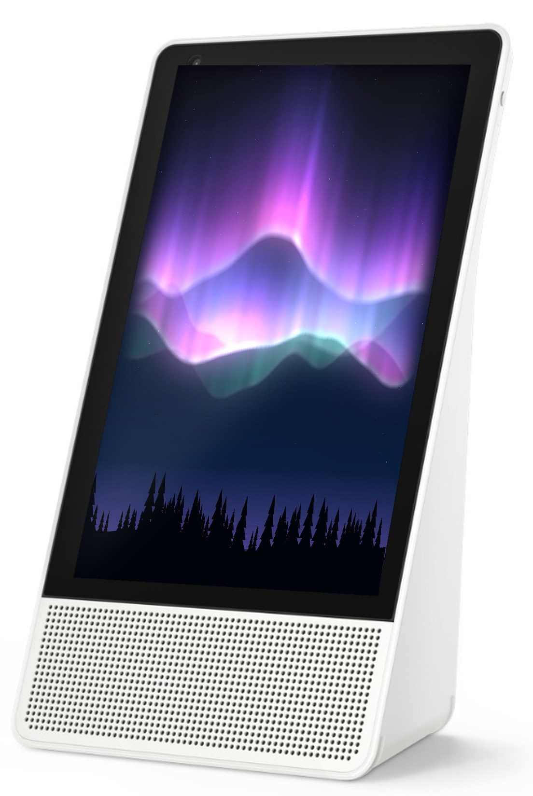
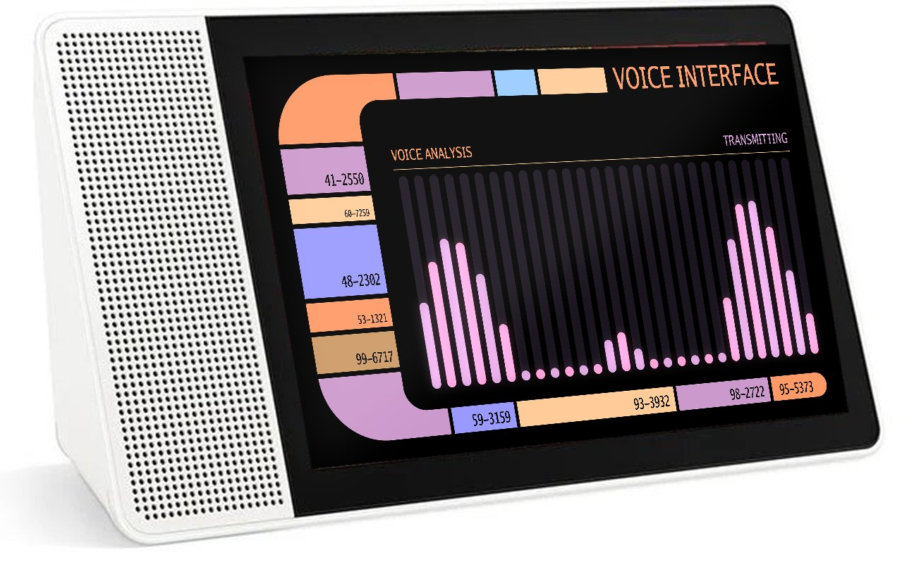
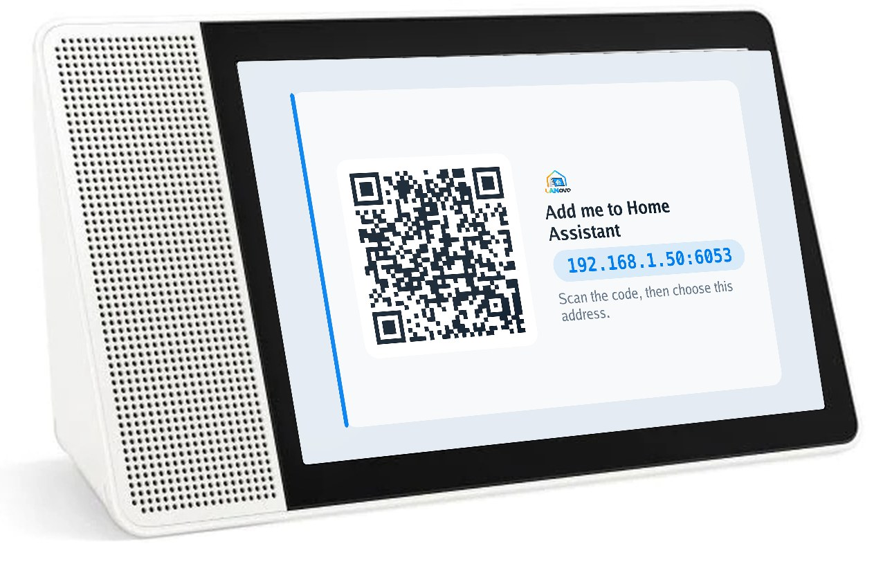

# LANovo

<a href="https://github.com/ygelfand/LANovo/stargazers"></a>
<a href="https://github.com/ygelfand/LANovo/releases"></a>
<a href="https://github.com/ygelfand/LANovo/releases/latest"></a>
<a href="https://buymeacoffee.com/ygelfand"></a>
<a href="https://discord.gg/efWnv89pg2"></a>

Turn a Lenovo Smart Display into a local Home Assistant display, speaker and voice assistant.

A pure-Go replacement for what Lenovo and Google shipped that speaks the ESPHome native API, so
Home Assistant discovers it the way it discovers any ESPHome device.

<p align="center">
  
  
</p>

Requires a display unlocked and running the Android 8.1 debug firmware — see
[xdaforums](https://xdaforums.com/t/lenovo-smart-display-8-10-amber-blueberry-avb-bootloader-unlock-firmware.4472049/) or
[xdaforums](https://xdaforums.com/t/cd-17302f-lenovo-smart-display-7-ivy-avb-bootloader-unlock-firmware.4472041/)
for details.

The installer expects the device to be connected via usb, and running the latest debug firmware

## Devices

| Codename      | Model                   | Status                            |
| ------------- | ----------------------- | --------------------------------- |
| **blueberry** | Lenovo Smart Display 10 | Supported, portrait and landscape |
| **amber**     | Lenovo Smart Display 8  | Theoretically supported, untested |
| **ivy**       | Lenovo Smart Display 7  | Supported, landscape              |

## Includes:

**100% on-device local wake words.** Supports [openWakeWord](https://github.com/dscripka/openWakeWord)
and [microWakeWord](https://github.com/kahrendt/microWakeWord) models, up to two assistants at once,
each with its own wake word and Assist pipeline, including "stop" detection.

**Screen customizations.** Clock faces, themes, wallpaper from Immich
The Smart Display 10/8 has an accelerometer, allowing you to run it in portrait or landscape mode

**Visuals.** Audio visualizers that react to sound, to what's playing, or both:

**Home Assistant control.** Control Home Assistant components from the display

**Speaker.** A native Home Assistant `media_player` for announcements and radio, a
Sendspin player for whole-home audio, a Bluetooth speaker for your
phone, and an optional Chromecast receiver.

**Camera.** An RTSP stream with a full and a sub stream for Frigate, Blue Iris or similar,
plus a snapshot camera in Home Assistant.

**Bluetooth proxy.** BLE advertisements forwarded to Home Assistant, so the display extends your
Bluetooth for integrations like [bermuda](https://github.com/agittins/bermuda).

**Sensors.** The proximity sensor can wake the screen as you walk up

**Updates.** New versions show up on Home Assistant's Updates page

## Installing

You need an unlocked display connected over USB. `lanovoctl` checks it, installs LANovo, and asks
for your Wi-Fi if the display isn't on a network yet:

```sh
lanovoctl check
lanovoctl install --name kitchen
```

It then turns up in Home Assistant on its own, and shows a code on screen to pair it.

<p align="center">
  
</p>

## Building it yourself

```sh
make build             # lanovoctl, lanovod and its native helpers
make dist              # lanovod, then lanovoctl carrying it
make install-lanovod   # build, install, and restart it on a connected display
```

## How it fits together

- **lanovod** runs on the display: the screen, the audio, the camera, the radios, the wake word
  engines, the conversation, and an ESPHome native API server. It is one static Go binary with no
  cgo.
- **lanovoctl** is the host CLI: checking, installing, Wi-Fi and pairing.
- **[go-esphome-device](https://github.com/ygelfand/go-esphome-device)** implements the device half of
  the ESPHome protocol, including the voice satellite and Bluetooth proxy.

## License

AGPL-3.0. See [LICENSE](LICENSE).
